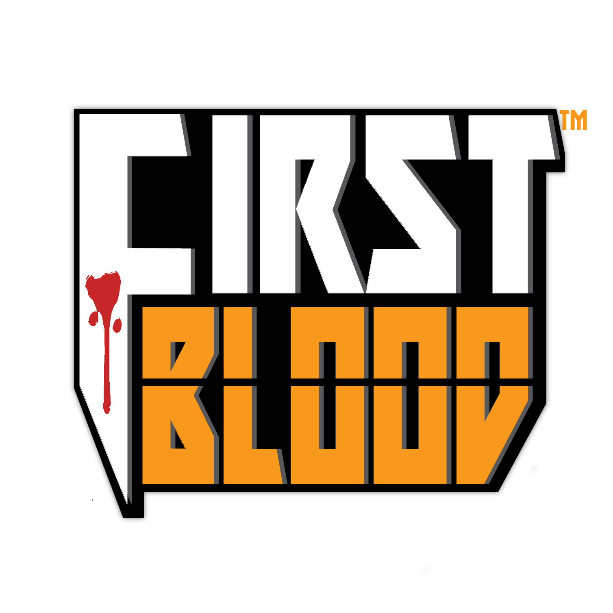
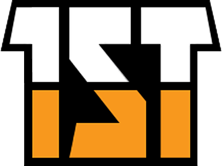
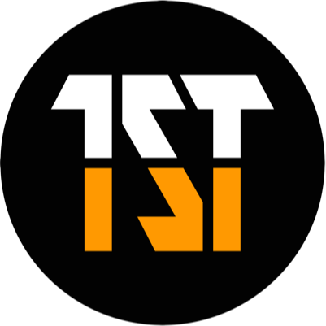
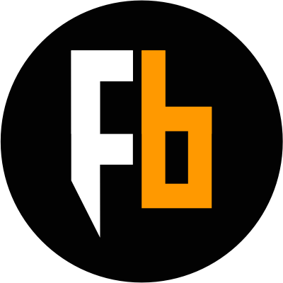

### NOTE: DO NOT USE FIRSTBLOOD LOGO WITHOUT OUR CONSENT.  (在我们的准许之前请勿使用我们的LOGO)

# FirstBlood Brand Assets 
A Decentralized eSports Platform Based on Smart Contract

# Contact
For commerical usage please contact team@firstblood.io  
For additonal media inquiries please contact marketing@firstblood.io  
For non-commercial usage please notify us at https://slack.firstblood.io

# Guidelines

## Site Logo
Main Color Theme (`#ff9900`)  
For app/article/blog with dark background (`#000000`), [original logo](logo.png) is recommended.  
For app/article/blog with light background (`#ffffff`), [logo with shield](logo_black_shied.png) is recommended  

## Token Logo
 
For token logo please use [1st_token_logo.png](1st_token_logo.png)  

### Circle Logo (1ST)
 
For circle token logo please use [1st_token_circle_400x400.png](1st_token_circle_400x400.png)  

### Pure FB Logo (FB)
 
For cicle fb logo please use [fb_token_circle_400x400.png](fb_token_circle_400x400.png)  

# Contents
<li>logo.png</li>
<li>favicon.jpg</li>
<li>favicon.ico</li>
<li>esports_global.png</li>
<li>logo-shadow.png	</li>
<li>logo_no_shield.png</li>
<li>logo_soft.png</li>
<li>token_utilities.png</li>
<li>crowdsale_time_zone.png.png</li>
<li>logo_black.png</li>
<li>logo_black_shied.png</li>
